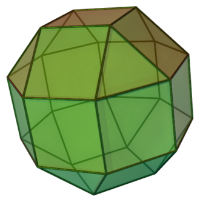

# GA Bounce


The goal of this project is to demonstrate the possibilities offered by **Conformal geometric algebra** (***CGA***) in computer graphics. It tries to present every **basic transformation** such as *translation*, *rotation*, *scale* and *reflection*, done through **CGA**, as well as a quick way to convert **CGA** to displayable data.

To achieve all these goals this, we used a **CGA** C++ library generated through [Garamon](https://github.com/vincentnozick/garamon) using [c3ga config file](https://github.com/vincentnozick/garamon/blob/master/conf/c3ga.conf), and **OpenGL** for the rendering.

The application consists of an arena made of **CGA** planes in which you can throw bouncing balls (**CGA** spheres) around.


## Usage

### Prerequisites

* `CMake >= 3.10`
* `SDL2 >= 2.0.2`
* `OpenGL >= 3.3`
* `GLEW >= 2.1.0`
* `eigen3 >= 3.3.0`

All other needed libraries are included in the repository.

### Compilation

The compilation is done through `CMake` :

````bash
mkdir build
cd build
cmake ..
make
````

Compilation has been tested with `g++ >= 7.5.0` and `clang >= 7.0.1`.

The program is launch with the compiled executable `ga_bounce`.

```
./ga_bounce
```

### Controls: 

* Movement :

    * `W` : Move forward.
    * `S` : Move backward.
    * `A` : Strafe left.
    * `D` : Straft right.  
    * `CTRL` : Move downward.
    * `SPACE` : Move upward.  
    * Use the mouse to look around.

* Ball :
    * `LEFT BUTTON` : Throw a ball.
    * `MOUSE WHEEL` : Change the speed of the ball.
    * `RIGHT CLICK` + `MOUSE WHEEL` : Change the size of the ball.
    * `MIDDLE CLICK` + `MOUSE WHEEL` : Change the number of bounces before a ball disappear.

* Others :  
    * `F10` : Switch debug information display.
    * `ALT` : Free mouse (allow to interact with debug display)  .
    * `ESC` To exit the application.

Balls' settings can also be changed on the debug display once the mouse has been freed.

Note that controls are given for a QWERTY` layout, they should adapt to your layout.


## Implementation


### Transformations

In **CGA**, transformations are done through **Versors** and are based on the geometric product of vectors, such transformations correspond to this algebra's characteristic "***sandwich***" operations. Wan can apply a **Versor** `V` to an object `x` by `sandwiching` it with its inverse: `V * x * V.inv()`.

In this application, this is done with the *Functor* [`Versor<T>`](include/app/Versor.hpp), which contains shortcut static factory such as:

* `Versor<T> dilator(T factor);`
            
* `Versor<T> rotor(const c3ga::Mvec<T> &bivector, double angle);`

* `Versor<T> translator(const c3ga::Mvec<T> &vector);`

* `Versor<T> translator(T x, T y, T z);`

`Versor<T>` can be applied on `const c3ga::Mvec<T>` or other `Versor<T>`.


### Arena

The arena is the inside of an [elongated square gyrobicupola](https://en.wikipedia.org/wiki/Elongated_square_gyrobicupola).



Since the elongated square gyrobicupola is convex, each plane corresponding to each face does not intersect witch each other inside the arena, but only on the outside. This results in the possibility to use these planes in **CGA** for collision detection and reflection computation between the surface of the arena and the balls.

An *elongated square gyrobicupola* is composed of 26 faces: 18 squares and 8 triangles. The implementation of the classes representing these type of faces are quite similar, they are composed of **3 points** for the Triangle, and **4 points** for the Square, **a plane** computed from the *wedge* of 3 of these points, and a **normal** computed from the *geometric product* of the plane and one of the points :

E.G. for the square :
```cpp
c3ga::Mvec<GLfloat> a, b, c, d; // 4 CGA points
c3ga::Mvec<GLfloat> plane = a ^ b ^ c ^ c3ga::ei<GLfloat>();
c3ga::Mvec<GLfloat> normal = plane * a;
```


The entire arena can be built with only 4 points, to which we apply *translator* and *rotor*. Example of such transformations can be found in [`src/app/object/Arena.cpp`](src/app/object/Arena.cpp).

Once every face is done and properly placed, we can retrieve the corresponding vertices in Euclidean Space (to use in *OpenGL*) as follow :

```cpp
// Retriving normal in euclidean space
c3ga::Mvec<GLfloat> orientation = (c3ga::ei<GLfloat>() | (!normal)) ^ c3ga::ei<GLfloat>();
orientation = orientation | c3ga::e0<GLfloat>();
orientation /= orientation.norm();
glm::vec3 euclideanNormal = { orientation[c3ga::E1], orientation[c3ga::E2], orientation[c3ga::E3] };

// Retriving vertices position in euclidean space
c3ga::Mvec<GLfloat> a0 = a / a[c3ga::E0];
c3ga::Mvec<GLfloat> b0 = b / b[c3ga::E0];
c3ga::Mvec<GLfloat> c0 = c / c[c3ga::E0];
c3ga::Mvec<GLfloat> d0 = d / d[c3ga::E0];
glm::vec3 aPos = { a0[c3ga::E1], a0[c3ga::E2], a0[c3ga::E3] };
glm::vec3 bPos = { b0[c3ga::E1], b0[c3ga::E2], b0[c3ga::E3] };
glm::vec3 cPos = { c0[c3ga::E1], c0[c3ga::E2], c0[c3ga::E3] };
glm::vec3 dPos = { d0[c3ga::E1], d0[c3ga::E2], d0[c3ga::E3] };
```

The face can now be rendered like any other object in *OpenGL*.


### Projectile

Projectiles are **CGA Sphere**, they can be modelized by a simple *multivector* resulting of the *wedge* of **4 CGA points**. To simplify transformations, we chose the four points so that the sphere is **centered at the origin** and have a **diameter of 1**, we then move the sphere to the camera position and dilate it with the current *size* settings. Since the projectile are moving, the class also store a **translator** built from the camera's *front vector* and the current *speed* settings :

```cpp
c3ga::Mvec<GLfloat> a = c3ga::point<GLfloat>(0.5f, 0, 0);
c3ga::Mvec<GLfloat> b = c3ga::point<GLfloat>(-0.5f, 0, 0);
c3ga::Mvec<GLfloat> c = c3ga::point<GLfloat>(0, 0.5f, 0);
c3ga::Mvec<GLfloat> d = c3ga::point<GLfloat>(0, 0, 0.5f);
        
c3ga::Mvec<GLfloat> multivector = a ^ b ^ c ^ d;
multivector = Versor<GLfloat>::dilator(size)(multivector);
multivector = Versor<GLfloat>::translator(position.x, position.y, position.z)(multivector);
translator = Versor<GLfloat>::translator(frontVector.x, frontVector.y, frontVector.z);
```

Like with the Square and Triangle, we can retrieve the corresponding vertices in Euclidean Space (to use in *OpenGL*) by computing the radius and center of the Sphere :

```cpp
c3ga::Mvec<GLfloat> dual = !this->multivector;
dual /= dual[c3ga::E0];
GLfloat radius = std::abs(std::sqrt(dual | dual));
glm::vec3 center = { dual[c3ga::E1], dual[c3ga::E2], dual[c3ga::E3] };
```

and using the euclidean equation of a sphere.

At each tick of the engine (60 per sec), the translator is applied to the sphere, and if a collision with the Arena occurred, the new translator resulting from the reflection is computed.

We can check that a collision occurred between a sphere and a plane by **checking the sign of the dual circle** resulting of the *inner product* of the dual of the sphere and the plane, and to compute the new translator, we can just *sandwich* the translator with the plane the sphere collided with : 

```cpp
c3ga::Mvec<GLfloat> collision = (!sphere) | plane;
if ((collision | collision) >= 0.f) {
    translator = plane * translator * !plane;
}
```
